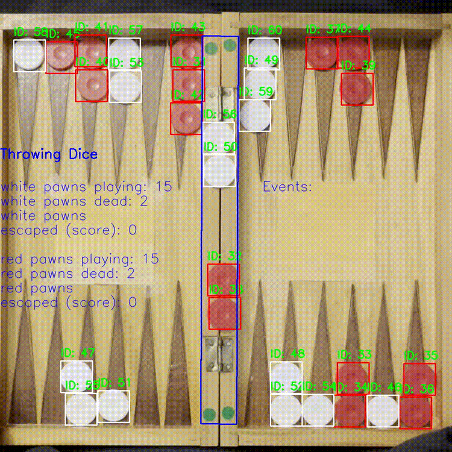

# 🎲 Backgammon Video Analyzer

This project processes videos of backgammon games (.mp4 files) and detects key elements of gameplay—including pawns, dice, the bar, and dice values. It then overlays the detected game events directly onto the video, producing a visually enhanced output that helps track game flow and decisions.

## ✨ Features

    🎯 Pawn Detection
    Identifies and tracks the positions of all pawns on the board.

    🎲 Dice Recognition
    Detects the dice and reads their values from each roll.

    🪟 Bar Detection
    Locates the bar throughout the game.

    📺 Overlay Annotations
    Adds visual labels and highlights to the original video to show:

        Dice results

        Position of pawns and the bar

        Key events

            Pawn escaping the board

            Pawn being put on the bar

            Pawn being taken off the bar

    📤 Output Video Generation
    Produces an annotated .mp4 file showing the analyzed gameplay.

## 📹 Example Output

Here are two example clips showing the system in action:
<p align="center">   </p>


## 🚀 Getting Started
### Prerequisites

    Python 3.12+

    OpenCV

    NumPy

### Install dependencies:

```bash
pip install -r requirements.txt
```

## Usage

Place your input .mp4 file(s) in the videos/ folder then run track_pawns.ipynb

The output (.mp4) will be placed in output/


## 🧠 How It Works

Under the hood, the system uses a combination of computer vision techniques to locate the objects and detect the events:

    Filter the image by color (different settings for red pawns, white pawns, dice and stickers used for bar detection)

    Perform the detection and counting of results of dice in detect_dice

    Detect pawns using HoughCircles after some processing

    Use sort tracker (https://github.com/abewley/sort) to track the pawns

    Detect 4 green stickers that indicate the corners of the bar using HoughCircles

    Calculate the position of the bar based on the stickers

    Count the amount of pawns on the board and on the bar

    Monitor the changes in the amount of pawns to detect events

    Overlay results using OpenCV drawing functions to generate the final output video


